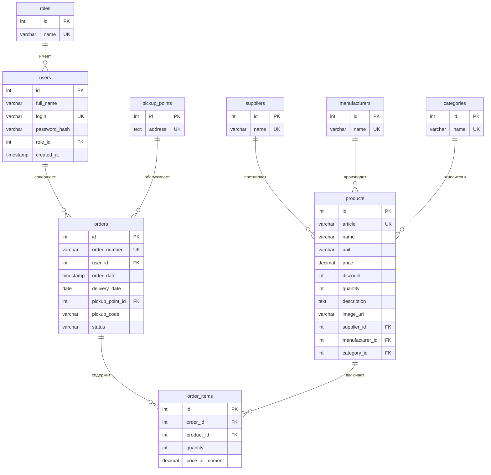

```mermaid
erDiagram
    roles {
        int id PK
        varchar name UK
    }

    pickup_points {
        int id PK
        text address UK
    }

    users {
        int id PK
        varchar full_name
        varchar login UK
        varchar password_hash
        int role_id FK
        timestamp created_at
    }

    suppliers {
        int id PK
        varchar name UK
    }

    manufacturers {
        int id PK
        varchar name UK
    }

    categories {
        int id PK
        varchar name UK
    }

    products {
        int id PK
        varchar article UK
        varchar name
        varchar unit
        decimal price
        int discount
        int quantity
        text description
        varchar image_url
        int supplier_id FK
        int manufacturer_id FK
        int category_id FK
    }

    orders {
        int id PK
        varchar order_number UK
        int user_id FK
        timestamp order_date
        date delivery_date
        int pickup_point_id FK
        varchar pickup_code
        varchar status
    }

    order_items {
        int id PK
        int order_id FK
        int product_id FK
        int quantity
        decimal price_at_moment
    }

    roles ||--o{ users : "имеет"
    users ||--o{ orders : "совершает"
    pickup_points ||--o{ orders : "обслуживает"
    orders ||--o{ order_items : "содержит"
    products ||--o{ order_items : "включает"
    suppliers ||--o{ products : "поставляет"
    manufacturers ||--o{ products : "производит"
    categories ||--o{ products : "относится к"
```
